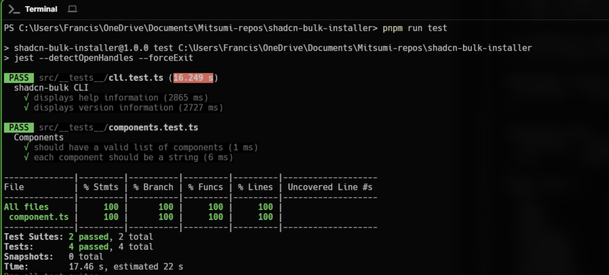

# shadcn-bulk-installer

A CLI tool for bulk installation of shadcn/ui components with an interactive interface and progress tracking.

<!-- image preview for test/png -->
<p align="center">
  
</p>
## Prerequisites

Make sure you have a Next.js project with shadcn/ui properly initialized. If not, follow these steps:

1. Create a Next.js project (if you haven't already):
   ```bash
   npx create-next-app@latest my-app --typescript --tailwind --eslint
   ```

2. Initialize shadcn/ui:
   ```bash
   npx shadcn@latest init
   ```

## Installation

```bash
npm install -g shadcn-bulk-installer
```

## Usage

Navigate to your Next.js project directory and run:

```bash
# Interactive component selection
shadcn-bulk install

# Install all available components
shadcn-bulk install --all
```

## Features

- Interactive multi-select interface for choosing components
- Option to install all components at once
- Progress tracking with status indicators
- Pre-installation project setup verification
- Concurrent installation with proper error handling

## Available Components

The tool supports all official shadcn/ui components, including:
- Accordion
- Alert Dialog
- Alert
- Avatar
- Badge
- Button
... (and many more)

## Error Handling

The tool will:
1. Verify that shadcn/ui is properly initialized in your project
2. Provide clear error messages if something goes wrong
3. Exit gracefully with helpful instructions when needed

## Contributing

Feel free to open issues or submit pull requests for improvements or bug fixes.